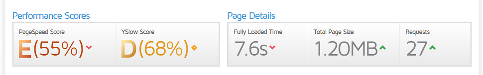
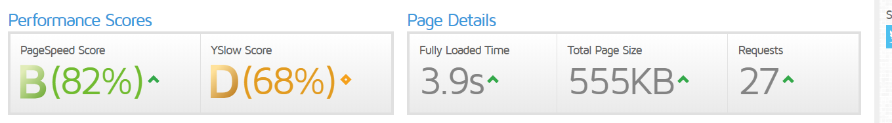

* content
{:toc}


几个月前，我们小团队辛苦用spring boot搭建了一个web项目，然后花了几千大洋购置了一台阿里云服务器。兴奋之余赶紧把项目部署在了服务器上。然后由于终于拥有了一台自己的服务器，恨不得把所有掌握的东西都尝试一翻。于是SVN、mysql、nginx、redis，加上我们的spring boot应用，全部一股脑地扔到了服务器上。然后等域名备案完，忙不迭地召唤大家访问网站，欣赏一下我们的战果。结果一访问网站，马上傻眼了，访问主页要10秒左右，里面的页面更是比乌龟还慢。当时大家一致认为是我们的服务器带宽太低（1Mb/s），于是大家一咬牙，凑钱把服务器带宽提到了2Mb/s。然而，提带宽之后，发现网站访问速度并没有明显的改善，主页访问还要七八秒的时间。由于囊中羞涩，大伙一商量，决定还是先凑合用着吧。于是大家忍受着慢腾腾的速度，还是各干各的事。

几天前，我的服务器被朋友征用，做一个小型网站。由于这个网站是给别人用的，访问慢的问题又一次被提了上来。由于之前的经验，我们第一时间想到的还是提升带宽，朋友说他出钱把带宽给升到10Mb/s，我查了一下，一个月要多花500大洋。于是我跟他说，你再等等，容我找找有没有其他优化方案，于是有了优化网站访问速度这一经历。

由于之前主要专注于代码开发，很少去关注网站访问这种问题。从开始寻找解决方案起，我感觉进入了一个新的领域。首先找到的是CSDN上的一篇[博文](https://blog.csdn.net/u011197448/article/details/56014108)，从中了解了CDN和一些优化加速的概念。然后顺藤摸瓜，找到了yahoo团队优化网站性能的14条规则（一说23条，还有说30多条的）。这14条规则分别为：

1. 尽可能的减少 HTTP 的请求数 
2. 使用 CDN（Content Delivery Network）  
3. 添加 Expires 头(或者 Cache-control ) 
4. Gzip 组件
5. 将 CSS 样式放在页面的上方 
6. 将脚本移动到底部（包括内联的）
7. 避免使用 CSS 中的 Expressions
8. 将 JavaScript 和 CSS 独立成外部文件
9. 减少 DNS 查询
10. 压缩 JavaScript 和 CSS (包括内联的)
11. 避免重定向
12. 移除重复的脚本 
13. 配置实体标签（ETags）
14. 使 AJAX 缓存

这十几条规则看得我是有点云里雾里，具体怎么实践还是一头蒙。于是我开始寻找有没有工具能替我分析一下我的网站有哪些性能的漏洞，不出所料，有一款firefox的插件叫yslow（意思是为啥慢嘞？）。由于我常用的是chrome浏览器，于是又找到了yslow的chrome版本。遗憾的是，yslow的chrome版本在2012年就停止维护了，在chrome商店里找到的版本不能成功安装。那么有没有同类的工具呢，我又找到了一款pagespeed插件，可惜这款插件又依赖谷歌开发者网站，如果挂VPN访问谷歌，又不能正确测试出网站的访问速度，于是这一尝试也失败了。几经周折，我找到了一个集成了yslow和pagespeed测试的网站，叫[gtmetrix](https://gtmetrix.com/)，这个网站可以自动替我们对目标网站进行pagespeed和yslow分析，而不依赖于浏览器。激动之余，赶紧给自己的网站跑一跑分，不出所料，pagespeed的评级为E级（55分），Yslow的评级为D级（68分），如下图：


右边显示了页面的详细状况，整个页面的大小达到了1.20MB，访问时间长达7.6秒，请求数达到了27个。再看细节的评分（当时忘截图了），优先级最高的项是Gzip压缩，两个工具都毫不留情的给我的网站打了F评级（0分）。于是结论出来了，我应该为我的网站开启Gzip压缩。

到此为止，一切变得清晰起来。由于我的spring boot应用前置了nginx服务器，而需要进行Gzip压缩的静态资源（css、js、图片）都是通过nginx访问的，因此我的问题变成了，如何使用nginx进行Gzip压缩。再百度之，发现nginx自带了这一功能，只需修改配置即可，于是找到了相应的nginx配置，拷贝到我的nginx.conf：

```conf
gzip on; #开启gzip
gzip_min_length 1k; #大于1K的文件使用压缩
gzip_buffers 4 16k; #gzip缓冲文件个数和大小
gzip_http_version 1.0; #HTTP通信版本，默认为1.1，改成1.0可以支持更多情况
gzip_comp_level 2; #压缩等级，1-10，等级高压缩效果好，但是吃性能，一般1或2就好
gzip_types text/plain application/x-javascript text/css application/xml text/javascript application/x-httpd-php image/jpeg image/gif image/png; #要压缩的文件
gzip_vary off; #启用应答头"Vary: Accept-Encoding"
gzip_disable "MSIE [1-6]\."; #不支持IE6以下的版本
```

修改完毕，保存，nginx -s reload，重新跑分，一气呵成。



果然，pagespeed的评分等级由E提升到了B，页面的大小也减少到了555KB，访问时间下降到了3.9秒。然而，YSlow评分咋没动嘞？而且，点开pagespeed和YSlow的评分细节，发现gzip一项的评分仍然都是F（0分）。诶？What？Excuse me？那时，我的心中万只神兽在奔腾。打开chrome浏览器，F12，查看response headers -> content-encoding，发现只有css和图片进行了gzip压缩，而js代码并没有进行gzip压缩。我又回头检查了一下nginx的配置，明明有text/javascript啊。再百度之，了解到有的浏览器js请求是application/javascript……好吧，你们赢了，于是修改nginx的配置：

```conf
gzip on; #开启gzip
gzip_min_length 1k; #大于1K的文件使用压缩
gzip_buffers 4 16k; #gzip缓冲文件个数和大小
gzip_http_version 1.0; #HTTP通信版本，默认为1.1，改成1.0可以支持更多情况
gzip_comp_level 2; #压缩等级，1-10，等级高压缩效果好，但是吃性能，一般1或2就好
gzip_types text/plain application/x-javascript application/javascript text/javascript text/css application/xml  application/x-httpd-php image/jpeg image/gif image/png; #要压缩的文件
gzip_vary off; #启用应答头"Vary: Accept-Encoding"
gzip_disable "MSIE [1-6]\."; #不支持IE6以下的版本
```

再次修改完毕，保存，nginx -s reload，重新跑分。


总算搞好了，pagespeed评级直接飙到了A（97分），YSlow的评分也提升到了C（78分），页面大小减少到了390KB，访问时间下降到3.0秒，初步优化完成。再看YSlow的推荐项，根据优先级从高到低重要的优化项依次还有减少请求数、使用CDN、静态资源使用独立域名（cookie-free domains），这些网上都有成熟的解决方案，回头有空可以研究一下写一写。3.0秒的访问速度对于我们正常使用来说已经算可以接受了，根据永远不要优化的原则，就暂时打住，记录下解决问题的思路和流程，与诸位分享之。