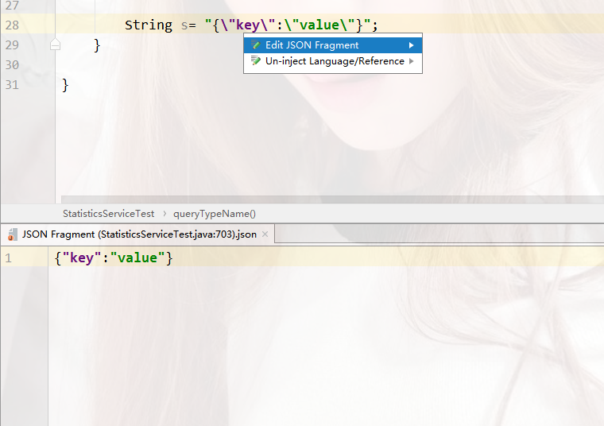

layout: post
title:  "提高开发效率的奇技（二）Intellij IDEA的进阶应用"
categories: Java
tags:  IDE Intellij
author: G. Seinfeld

* content
{:toc}

### 闲话
> 工欲善其事，必先利其器。

一款好的IDE（集成开发环境，Integrated Development Environment）对于程序员就像一把好的兵器对于武将一样重要，这句话对于Java这种笨重的语言而言尤其适用。好在Java有了集美貌与智慧于一身的IDE——Intellij IDEA，它就像二爷的赤兔马和青龙偃月刀一样在Java世界中奋勇杀敌。如果你在使用Eclipse或者Netbeans之类的IDE，在继续阅读之前我建议你尝试一下Intellij IDEA，你会爱上它的。如果你已经在使用IDEA了，这篇文章会给你一些进阶应用的指南，让你的神兵用起来更加得心应手。今天我们主要介绍一下IDEA的语言注入功能、自定义代码模板以及简单的重构技巧。

### 干货
#### 语言注入（language injection）
语言注入是指在Java的字符串里书写另一种语言时将该语言的特征（高亮、语法检查等）注入到字符串中。比如，有时我们需要用Java字符串来表达SQL语句、JSON串或者正则表达式。这时我们可以在要注入的字符串中按Alt+Enter，如下图：


然后选择Inject language or reference


比如这里我们选择JSON，我们可以看到JSON字符串的key部分被高亮了：


如果选择的语言有自动补全的功能，在这里也可以直接使用自动补全功能。如果语法不符合该语言的语法，也会有编译器的错误提示。总之，就像你真的再写这种语言一样。但是有一点不爽的是，在字符串里面需要注意转义的事情。IDEA的设计者显然也考虑到了这个问题，因此还提供了Edit XXX Fragment的功能，其中XXX是指你注入的语言。



在已经注入语言的字符串上再次按Alt+Enter，选择Edit XXX Fragment，弹出下面的输入窗，可以在该窗口中直接书写相应的语言，在上面的字符串中，IDEA会自动替你将该转义的东西转义掉，这点对于写正则表达式而言特别方便。顺便一提，如果你注入的是正则表达式的话，IDEA还提供了Check RegExp功能，用于检查你指定的字符串与正则表达式是否匹配。

除了使用上面提到的方式进行语言注入外，还可以通过添加注释的方式进行语言注入，即在需要注入的字符串上方写入形如
```java
// language=LANG prefix = PRE suffix=SUF
```
的注释，其中LANG是你要注入的语言，prefix和suffix分别是指定的前后缀，如果没有可以省略。如果你的字符串表达的不是一个完整的语言片段，可以通过前后缀的拼接使其形成一个完整的语言片段，如下图的html示例：


#### 自定义代码模板（live templates）

live templates是IDEA中提高代码编写速度，减少重复性工作的又一大利器。用过IDEA的人应该基本都使用过内置的代码模板，只不过可能不知道而已。下面列举几个常用的live templates:

- psvm大法

是public static void main的缩写，依次敲入这几个字母可以在一个类中快速生成main方法。

```java
public static void main(String[] args) {
        
}
```

- sout大法

用于快速生成输出语句
```java
System.out.println();
```

- psfs （字符串常量）

用于快速生成字符串常量
```java
public static final String
```

- fori （普通for循环）
用于快速生成普通for循环的代码

```java
for (int i = 0; i < ; i++) {
            
}
```

- iter  （增强for循环）

用于快速生成增强for循环代码，其中要遍历的对象以及元素类型可以推断，元素对象名称可以推荐。

```java
for (String key : map.keySet()) {
            
}
```

- ifn （if null）

用于生成判空的条件判断语句，判断的对象自动推断

```java
if (s == null) {

}
```

- inn（if not null）

用于生成判断非空的条件判断语句，判断的对象自动推断
```java
if (s != null) {

}
```

这些官方提供的内置模板已经足够nice，但是可能不能充分满足我们自己特殊场景的使用。我们可以根据自身使用的情况DIY我们自己的模板。那么怎么定义我们自己的代码模板呢？

首先按Ctrl+Alt+S打开设置（或者点击File-Settings），找到Editor下的Live Templates选项，进入自定义模板页面。


这里默认是按照语言和用途分的组，我们可以新增自己的模板组，点击右上角的小加号，选择template group即可。接下来是在已有组中增加模板，点击右上角的小加号，选择live template。或者利用现有的模板进行duplicate（右上角第三个按钮）也可以。比如我们新建一个待办事项的注释，想要指定用户和时间：


我们首先增加一个自定义模板组comment，在下面添加一个todo模板，在Abbreviation（缩写）里面写入todo，即写代码时要输入的模板简写，在右边description中输入模板的描述信息，在下面Template text中写入模板内容：

```java
//TODO $DATE$ $USER$: $END$
```

其中//TODO是Java中待办事项的注释，后面$DATE$和$USER$是自定义的变量，分别代表日期和用户，$END$是IDEA内置的变量，代表生成模板后光标所处的位置。很容易想到，两个美元符号$$中间加上大写字母是模板中定义变量的方式。那么这些变量怎么取值呢，我们点击右侧的Edit variables按钮，就可以看到这样的界面：


这里可以看到DATE和USER变量的取值，分别为date()和user()，date()和user()是IDEA内置的两个函数，用于表征当前时间和当前系统用户，如果Expression（表达式）项没有取到值，我们还可以在Default value中设置默认值，不过不是所有项都可以走默认值的，勾选右边的复选框代表如果变量取到确切值，光标直接跳过此处。IDEA提供了几十个内置函数，用于处理模板中的各种情况，内置函数的完整列表可以参见官方文档（https://www.jetbrains.com/help/idea/template-variables.html#predefined_functions）。

#### 重构（refactor）

重构是编写代码的一个重要环节，它是在基本不改变代码语义的前提下，对代码直观性、可读性以及代码逻辑层次进行的改造。重构的技巧非常多，大牛们经常花一本书的内容来介绍重构。这里我们只介绍怎么在IDEA中方便地进行常见的代码重构。首先先普及一样IDEA中万能重构的快捷键：Ctrl+Alt+Shift+T，一切重构都可以以此为入口。在IDEA中最常用的重构主要包括重命名（rename）、代码提取（extract）、代码嵌入（inline）。

- rename

重命名，或者叫改名。有时候我们会觉得类、方法、变量名称不能准确表达我们要传递给读者的含义，此时我们就需要重命名。IDEA中重命名的快捷键是Shift+F6，当然也可以从万能入口进入。重命名后所有调用之处会自动修改引用的名称。

- extract

代码提取，可以指从实现类中提取接口或父类，也可以指从代码中提取方法。下面说一些常见的场景：
1. 当我们发现一段代码在一个逻辑层面上不止做了一件事时，我们就需要将代码提取成一个方法。
2. 当系统中出现两处以上重复代码时，我们也需要将重复代码提取成公共方法。
3. 当系统不希望将过多细节暴露给开发者时，我们需要将实现类提取成接口。
不同的代码提取对应不同的快捷键，建议直接从万能入口进入。

- inline
嵌入是提取的逆过程。下面是一些常见场景：
1. 当我们删除一个被多次引用的空函数时，我们就需要对这些空函数进行inline操作。
2. 当我们发现代码的逻辑层次发生改变，需要提升逻辑层级时，可以用到inline操作。
3. 消除只出现一次的局部变量可以使用inline操作。

### 最佳实践
1. 在Java字符串中书写其他语言时，使用语言注入，这样可以避免语法的错误，也不必手动对特殊字符进行转义。
2. 将常用的代码片段提取成live templates，这样可以快速生成代码，减少重复工作量。
3. 经常重构自己的代码，提高代码的可读性和直观程度。
4. 在编写接口和实现类时，先编写实现类，再提取成接口。

